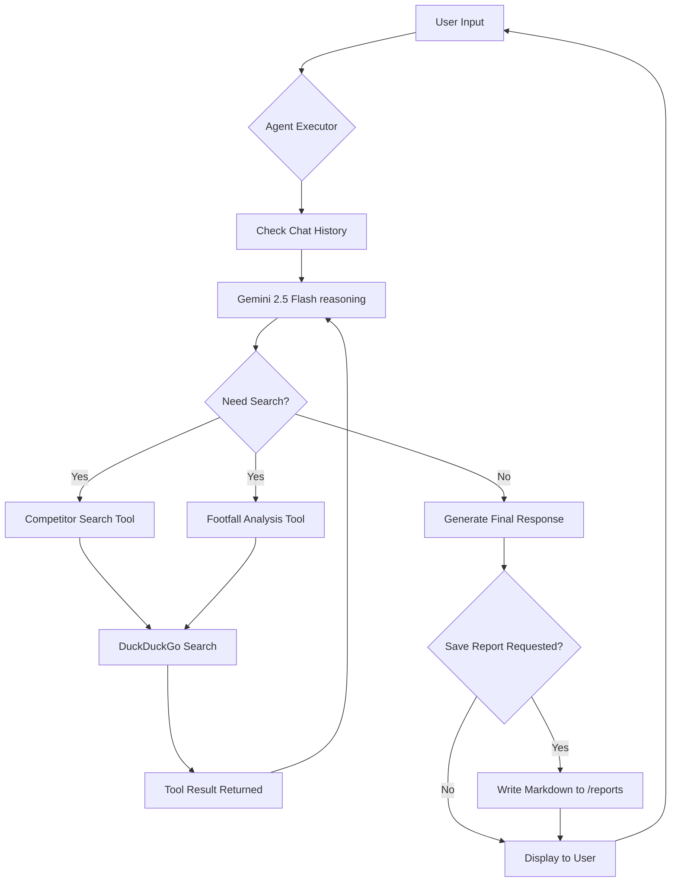

# Conversational AI — Clothing Store Competitor Analyzer

[](https://github.com/SANJAI-s0/clothing-store-competitor-analyzer/blob/main/LICENSE)
[](https://www.python.org/downloads/)
[](https://deepmind.google/technologies/gemini/)
[](https://www.langchain.com/)
[](https://github.com/SANJAI-s0/clothing-store-competitor-analyzer)
[](https://github.com/SANJAI-s0/clothing-store-competitor-analyzer/commits/main)

A sophisticated conversational AI pipeline designed to empower retail entrepreneurs and clothing store owners with real-time market intelligence. Using advanced LLM reasoning and live web search, this tool identifies local competitors, analyzes consumer behavior patterns, and provides strategic recommendations through an intuitive chat interface.

---

## 📖 Table of Contents

- [Overview](#-overview)
- [Problem Statement](#-problem-statement)
- [Key Features](#-key-features)
- [Workflow Architecture](#-workflow-architecture)
- [Tech Stack](#-tech-stack)
- [Project Structure](#-project-structure)
- [Installation & Setup](#-installation--setup)
- [Usage Guide](#-usage-guide)
- [Environment Variables](#-environment-variables)
- [Contributing](#-contributing)
- [License](#-license)

---

## 🌟 Overview

The **Clothing Store Competitor Analyzer** transforms the way small business owners gather market data. Instead of spending hours manually searching for competitors and trying to estimate their peak hours, owners can simply "chat" with their data assistant. The system uses a **Gemini 2.5 Flash** agent powered by **LangChain** to perform real-time searches and synthesize complex information into actionable reports.

### Target Audience:
- **Boutique Owners:** Discover who else is competing for the same customers in your neighborhood.
- **Retail Strategists:** Identify high-traffic windows to optimize staffing and marketing.
- **New Entrants:** Validate potential store locations based on existing market saturation.

---

## 🛠️ Key Features

- **🧠 Intelligent Reasoning:** Leverages Gemini 2.5 Flash for high-speed, accurate multi-step reasoning.
- **🔍 Live Web Intelligence:** Real-time competitor discovery and footfall analysis via integrated search tools.
- **🕒 Dynamic Footfall mapping:** Identify peak hours, weekend trends, and customer traffic spikes for specific competitors.
- **📄 Automated Reporting:** Generates professionally structured Markdown reports exported directly to your workspace.
- **💬 Conversational Memory:** Remembers previous context (e.g., specific locations or stores mentioned) for a seamless inquiry flow.
- **🚀 Zero-Cost Search:** Uses DuckDuckGo search integration, eliminating the need for expensive SE API keys.

---

## 🏗️ Workflow Architecture

The following diagram illustrates the decision-making process of the AI agent during a typical session:



---

## 💻 Tech Stack

- **Large Language Model:** [Google Gemini 2.5 Flash](https://aistudio.google.com/)
- **Orchestration:** [LangChain Agent Framework](https://python.langchain.com/)
- **Search Engine:** DuckDuckGo (via LangChain Community)
- **Programming Language:** Python 3.9+
- **Configuration:** `python-dotenv` for secure secret management

---

## 📂 Project Structure

```bash
Conversational_AI/
├── reports/               # Auto-generated markdown reports (.md)
├── Flow/                  # Workflow diagrams and logic flows (.mmd)
│   └── workflow.mmd
├── .env                   # Private environment variables (API Keys)
├── .env.example           # Shared template for environment setup
├── .gitignore             # Standard Python git exclusions
├── LICENSE                # MIT License information
├── conversational_ai.py   # Core logic & AI Agent implementation
├── README.md              # Project documentation (you are here)
└── requirements.txt       # Python dependency list
```

---

## ⚙️ Installation & Setup

### 1. Clone the Repository
```bash
git clone https://github.com/SANJAI-s0/clothing-store-competitor-analyzer.git
cd clothing-store-competitor-analyzer
```

### 2. Prepare Environment
Create a virtual environment and install dependencies:
```bash
python -m venv venv
source venv/bin/activate  # On Windows: venv\Scripts\activate
pip install -r requirements.txt
```

### 3. Configure API Keys
1. Get a free Gemini API Key from [Google AI Studio](https://aistudio.google.com/).
2. Create your `.env` file from the example:
   ```bash
   cp .env.example .env
   ```
3. Open `.env` and paste your key:
   ```env
   GEMINI_API_KEY=your_key_here
   ```

---

## 🚀 Usage Guide

Launch the interactive assistant:
```bash
python conversational_ai.py
```

### Example Conversation Flow:

1. **Discovery:**
   > "Find me 5 popular clothing stores near Indiranagar, Bangalore."
2. **Analysis:**
   > "When are these stores most crowded on weekends?"
3. **Synthesis:**
   > "Please generate a full competitor report for this location."

**Note:** When you type "report", the agent automatically compiles your entire conversation into a structured file inside the `reports/` folder.

---

## 🔑 Environment Variables

| Variable | Required | Description |
|---|---|---|
| `GEMINI_API_KEY` | **Yes** | Your Google Gemini API Key |

---

## 🤝 Contributing

Contributions are welcome! If you have ideas for new tools (e.g., pricing analysis, sentiment analysis from reviews), feel free to:
1. Fork the Project
2. Create your Feature Branch (`git checkout -b feature/AmazingFeature`)
3. Commit your Changes (`git commit -m 'Add some AmazingFeature'`)
4. Push to the Branch (`git push origin feature/AmazingFeature`)
5. Open a Pull Request

---

## 📄 License

Distributed under the MIT License. See `LICENSE` for more information.

---

<p align="center">
  Built with ❤️ by <a href="https://github.com/SANJAI-s0">Sanjai S0</a>
</p>
